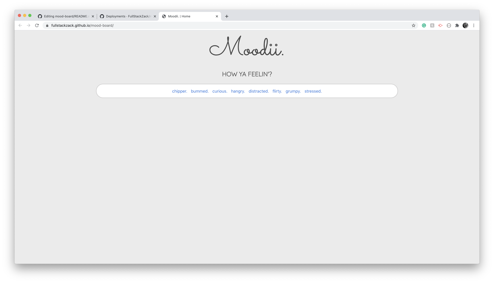
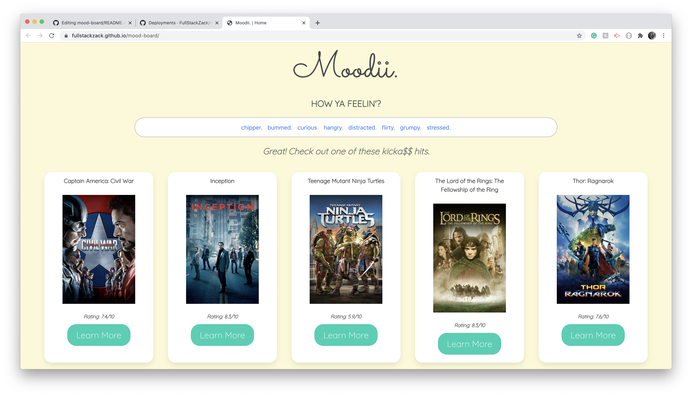
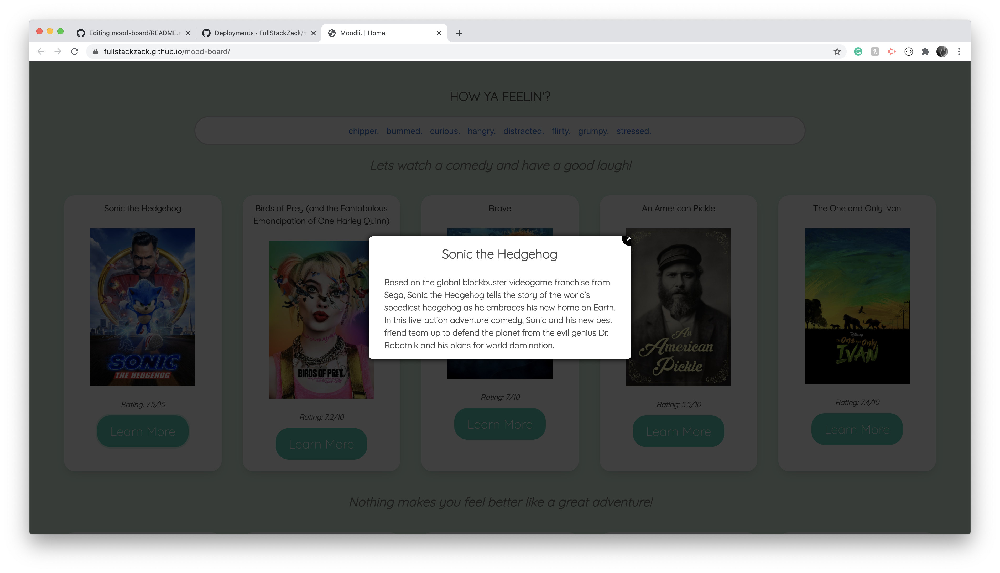

# Mood Board

User Story
-------------------------------------

As a user
I want to be able to click on different mood choices on the homepage
I want to select from different movies choices when I am feeling chipper
I want to select from different comedy choices when I am feeling bummed
I want to select from different documentaries when I am feeling curious
I want to select from different shows when I am feeling hangry
I want to select from different movies when I am distracted
I want to select from different romantic drama series when I am feeling flirty
I want to select from different movies when I am feeling grumpy
I want to select from different when I am feeling stressed

Acceptance Criteria
-------------------------------------
User must be able to click on different mood choices
User must be directed to the associated movie choices when the chipper button is selected
User must be directed to the associated comedy choices when the bummed button is selected
User must be directed to the associated documentaries when the curious button is selected
User must be directed to the associated shows when the hangry button is selected
User must be directed to the associated movie choices when the distracted button is selected
User must be directed to the associated romantic drama when the flirty button is selected
User must be directed to the associated movie choices when the grumpy button is selected
User must be directed to the associated movie choices when the stressed button is selected
Each movie, documentary or commedy must be displayed in a card
Each movie, documentary or commedy must show ratings
Wach movie, documentary or comedy must show the learn more button
The learn more button must show details about the movie, comedy or documentary

API used for the Project
-------------------------------------
Movies: https://www.themoviedb.org/

Deployed Link: https://fullstackzack.github.io/moodii/

